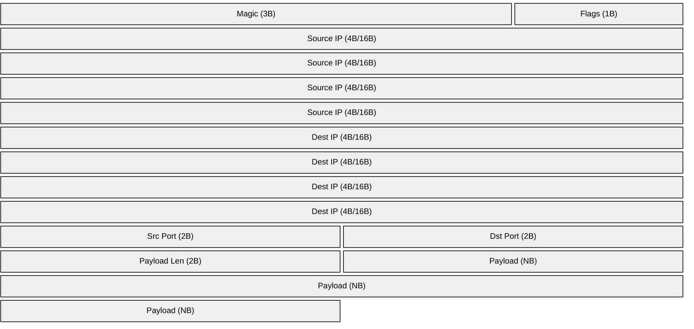

# Binary Stream Protocol

## Overview

`rs-udp-sender` reads packets from stdin using a binary framing protocol. The protocol is identical to the Go implementation and supports both IPv4 and IPv6 packets in the same stream.

## Protocol Specification

### Packet Format

Each packet uses this layout (all multi-byte values are network byte order / big endian):



| Field | Size | Type | Description |
|-------|------|------|-------------|
| Magic | 3 bytes | const | Magic number `0xC1 0x21 0xB1` |
| Flags | 1 byte | bitfield | Bit 0: IP version (`0` = IPv4, `1` = IPv6); bits 1-7 reserved |
| Source IP | 4 or 16 bytes | IPv4/IPv6 | Source address |
| Dest IP | 4 or 16 bytes | IPv4/IPv6 | Destination address |
| Source Port | 2 bytes | uint16 | Source UDP port |
| Dest Port | 2 bytes | uint16 | Destination UDP port |
| Payload Length | 2 bytes | uint16 | Payload size in bytes |
| Payload | variable | bytes | UDP payload bytes |

### Field Details

#### Magic (3 bytes)

- Constant `0xC1 0x21 0xB1`
- Used to detect stream corruption/misalignment
- Invalid value is a terminal parse error

#### Flags (1 byte)

- Bit 0:
  - `0` = IPv4 (addresses are 4 bytes each)
  - `1` = IPv6 (addresses are 16 bytes each)
- Bits 1-7 reserved for future use
- Writers should set only known bits; readers should ignore unknown reserved bits

#### Source/Destination IP

- IPv4 values are raw 4-byte network-order addresses
- IPv6 values are raw 16-byte network-order addresses
- Source and destination address width is determined by the IPv6 flag bit

#### Source/Destination Port

- Unsigned 16-bit values, big endian

#### Payload Length + Payload

- Length is uint16 big endian
- Payload is exactly that many bytes (can be zero)

## Hex Examples (identical wire format)

### Example 1: IPv4 packet

```text
C1 21 B1        # Magic: 0xC1 0x21 0xB1
00              # Flags: 0x00 (IPv4)
0A 00 00 01     # Source IP: 10.0.0.1
C0 A8 01 64     # Dest IP: 192.168.1.100
13 88           # Source Port: 5000 (0x1388)
02 02           # Dest Port: 514 (0x0202)
00 05           # Payload Length: 5
48 65 6C 6C 6F  # Payload: "Hello"
```

### Example 2: IPv6 packet

```text
C1 21 B1                                         # Magic: 0xC1 0x21 0xB1
01                                               # Flags: 0x01 (IPv6)
20 01 0D B8 00 00 00 00 00 00 00 00 00 00 00 01  # Source IP: 2001:db8::1
20 01 0D B8 00 00 00 00 00 00 00 00 00 00 01 00  # Dest IP: 2001:db8::100
13 88                                            # Source Port: 5000
1F 90                                            # Dest Port: 8080 (0x1F90)
00 05                                            # Payload Length: 5
48 65 6C 6C 6F                                   # Payload: "Hello"
```

### Example 3: Multiple IPv4 packets

```text
C1 21 B1 00 0A 00 00 01 C0 A8 01 64 13 88 02 02 00 06 54 65 73 74 20 31
C1 21 B1 00 0A 00 00 02 C0 A8 01 64 13 89 02 02 00 06 54 65 73 74 20 32
C1 21 B1 00 0A 00 00 03 C0 A8 01 64 13 8A 02 02 00 06 54 65 73 74 20 33
```

### Example 4: Mixed IPv4 + IPv6 stream

```text
C1 21 B1 00 0A 00 00 01 C0 A8 01 64 13 88 02 02 00 04 49 50 76 34
C1 21 B1 01 20 01 0D B8 00 00 00 00 00 00 00 00 00 00 00 01 20 01 0D B8 00 00 00 00 00 00 00 00 00 00 01 00 13 88 1F 90 00 04 49 50 76 36
```

### Example 5: Empty payload

```text
C1 21 B1       # Magic: 0xC1 0x21 0xB1
00             # Flags: 0x00 (IPv4)
0A 00 00 01    # Source IP: 10.0.0.1
C0 A8 01 64    # Dest IP: 192.168.1.100
13 88          # Source Port: 5000
02 02          # Dest Port: 514
00 00          # Payload Length: 0
               # no payload bytes
```

### Example 6: Invalid magic

```text
FF FF FF       # Wrong magic
00             # Flags
...
```

Error (Rust):

```text
invalid magic number: got [0xFF 0xFF 0xFF], expected [0xC1 0x21 0xB1] - stream may be misaligned
```

## Rust Encoding Example

```rust
use std::io::{self, Write};
use std::net::{IpAddr, Ipv4Addr, Ipv6Addr};

const MAGIC: [u8; 3] = [0xC1, 0x21, 0xB1];
const FLAG_IPV6: u8 = 0x01;

fn write_ipv4_packet(
    out: &mut impl Write,
    src_ip: Ipv4Addr,
    src_port: u16,
    dest_ip: Ipv4Addr,
    dest_port: u16,
    payload: &[u8],
) -> io::Result<()> {
    out.write_all(&MAGIC)?;
    out.write_all(&[0x00])?;
    out.write_all(&src_ip.octets())?;
    out.write_all(&dest_ip.octets())?;
    out.write_all(&src_port.to_be_bytes())?;
    out.write_all(&dest_port.to_be_bytes())?;
    out.write_all(&(payload.len() as u16).to_be_bytes())?;
    out.write_all(payload)?;
    Ok(())
}

fn write_ipv6_packet(
    out: &mut impl Write,
    src_ip: Ipv6Addr,
    src_port: u16,
    dest_ip: Ipv6Addr,
    dest_port: u16,
    payload: &[u8],
) -> io::Result<()> {
    out.write_all(&MAGIC)?;
    out.write_all(&[FLAG_IPV6])?;
    out.write_all(&src_ip.octets())?;
    out.write_all(&dest_ip.octets())?;
    out.write_all(&src_port.to_be_bytes())?;
    out.write_all(&dest_port.to_be_bytes())?;
    out.write_all(&(payload.len() as u16).to_be_bytes())?;
    out.write_all(payload)?;
    Ok(())
}
```

## Python Example (language-agnostic)

```python
import socket
import struct
import sys

def write_ipv4_packet(src_ip, src_port, dest_ip, dest_port, payload):
    sys.stdout.buffer.write(bytes([0xC1, 0x21, 0xB1]))
    sys.stdout.buffer.write(bytes([0x00]))
    sys.stdout.buffer.write(socket.inet_aton(src_ip))
    sys.stdout.buffer.write(socket.inet_aton(dest_ip))
    sys.stdout.buffer.write(struct.pack('!HH', src_port, dest_port))
    sys.stdout.buffer.write(struct.pack('!H', len(payload)))
    sys.stdout.buffer.write(payload.encode())
```

## Parser Behavior and Errors

`ProtocolStream` enforces:

1. valid magic
2. valid address width based on flags
3. complete frame reads (EOF mid-frame is error)
4. MTU limit before handoff to send path

Error classes include:

- `InvalidMagic`
- `ReadMagic`, `ReadField`, `ReadPayload`
- `IPv6NotAvailable`
- `MTUExceeded`

## MTU Validation

MTU is configurable (`--mtu`, default `1500`, range `576..=9000`).

Default payload limits:

- IPv4 payload max: `1500 - 20 - 8 = 1472`
- IPv6 payload max: `1500 - 40 - 8 = 1452`

Oversized packets are dropped and logged with packet metadata.

## Best Practices

- Keep payload within MTU-derived limits
- Validate source/destination IP version consistency
- Start with low packet counts when validating pipelines
- Monitor `packets_dropped` and error logs in output ND-JSON
